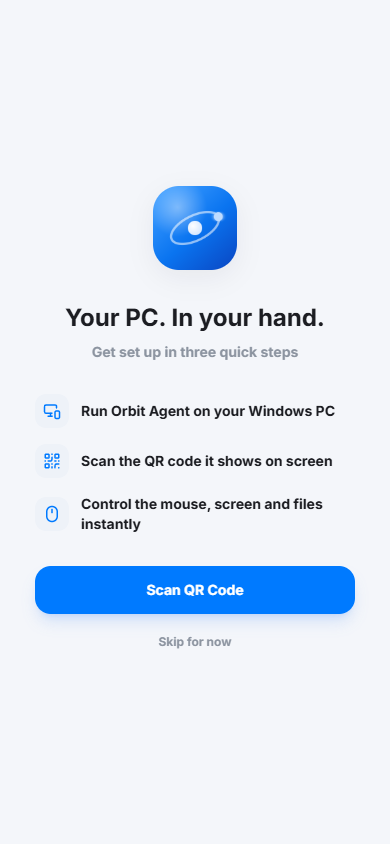
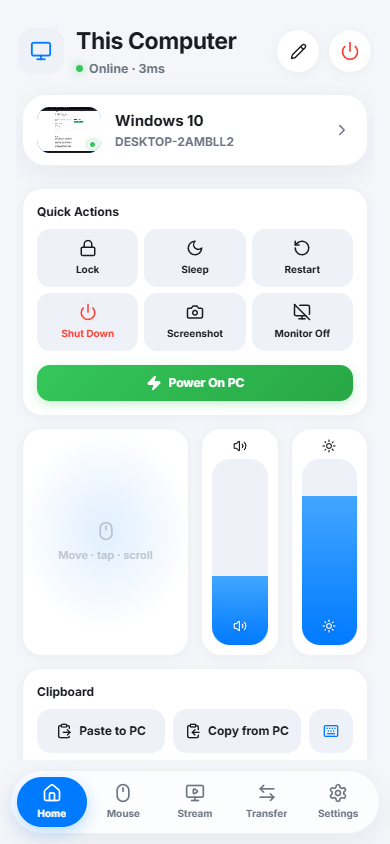
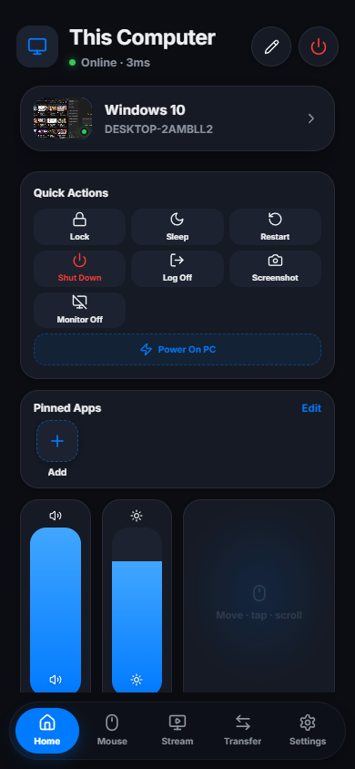
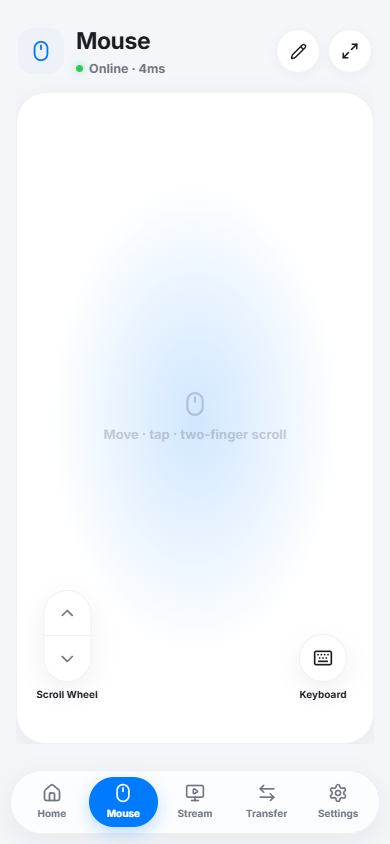
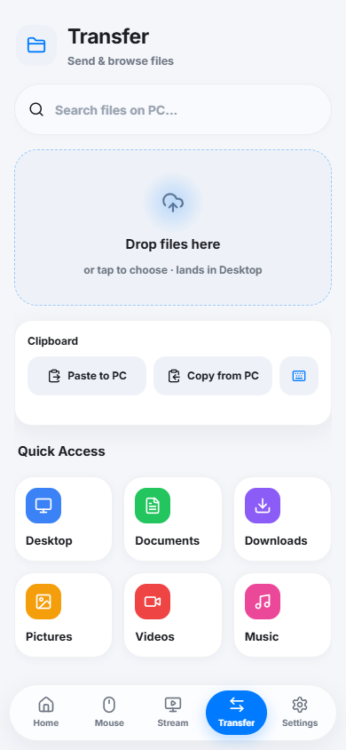
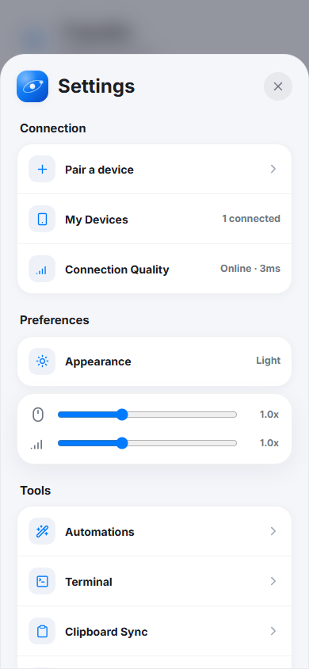

<div align="center">


# Orbit

**Your PC. In your hand.**

An iOS-style remote control for your Windows PC — trackpad, screen streaming, file transfer,
volume, power actions and more. Runs as a PWA on your phone, no app store needed.

100% local. No cloud, no accounts, no telemetry. Just your Wi-Fi.

[](LICENSE)
[](#requirements)
[-black)](#step-3--connect-your-phone)

</div>

---

## Screenshots

| Onboarding | Home | Home (dark) |
|:---:|:---:|:---:|
|  |  |  |

| Trackpad | File transfer | Settings |
|:---:|:---:|:---:|
|  |  |  |

## Features

- 🖱 **Trackpad** — move the cursor, tap to click, two-finger scroll and right-click, drag lock. Freely arrange extra buttons (scroll wheel, keyboard, clicks) anywhere on the pad with magnetic snapping.
- 🖥 **Live screen streaming** — watch your PC screen on the phone with adjustable quality/FPS, touch the stream to control the cursor, PC audio streaming, fullscreen mode.
- ⌨️ **Remote keyboard** — full text input with modifier keys and hotkey combos.
- 📁 **File transfer** — browse drives, download files to the phone, or just drop files on the phone and they land on your desktop (with photo thumbnails during upload).
- 🧩 **Customizable Home** — iOS-style widget grid: volume/brightness sliders (Control-Center style), system stats, pinned apps, app shortcuts, macros, live screen thumbnail — add, remove, resize, reorder.
- ⚡ **Quick actions** — lock, sleep, restart, shut down, log off, screenshot, monitor off, empty recycle bin.
- 🚀 **App launcher** — scans your Start Menu, shows real .exe icons, launches anything in one tap.
- 🤖 **Automations** — record multi-step macros (launch apps, key combos, text, delays, system actions) and run them from a widget.
- 📊 **System monitor** — CPU, RAM, disk, uptime, battery.
- 🌙 **Light & dark themes**, glassmorphism, buttery animations.

## How it works

```
┌─────────────┐   Wi-Fi (LAN only)   ┌──────────────────────────┐
│  Phone PWA  │ ◄──── HTTP + WS ────►│  Orbit Agent (Windows)   │
│ React + TS  │   HMAC-SHA256 auth   │  Python + FastAPI (tray) │
└─────────────┘                      └──────────────────────────┘
```

- The **agent** is a small Python server that lives in your system tray. It serves the web app, advertises itself over mDNS and executes input/system commands.
- The **PWA** is a React app you open once in the phone browser and add to your home screen. It talks to the agent directly over your local network.
- Pairing is a **QR code**: the tray app shows it, the phone camera scans it, done. Every request after that is signed with HMAC-SHA256 using a per-device shared secret.

## Download & run (no install)

The easiest way — **no Python, no Node, nothing to install**:

1. Grab the latest **`Orbit-windows.zip`** from the [**Releases**](https://github.com/yovrah/orbit/releases) page.
2. Unzip it anywhere and double-click **`Orbit.exe`**.
3. The Orbit icon appears in your system tray and a window pops up with a **QR code**.
4. Point your phone camera at the QR — it opens Orbit and connects automatically.
5. Add it to your home screen so it feels native: **iOS** Share → *Add to Home Screen*; **Android** ⋮ → *Add to Home screen*.

Tray menu: **Show connection QR** · **Open Orbit in browser** · **Quit Orbit**.

> **First launch shows a blue Windows SmartScreen warning** ("Windows protected your PC"). That's normal for small free apps that aren't code-signed — click **More info → Run anyway**. The code is fully open here if you'd rather build it yourself.

## Build from source (developers)

### Requirements

- Windows 10/11 PC with Python **3.11+**
- Node.js 18+ (only to build the frontend once)
- Phone and PC on the same Wi-Fi network

### Step 1 — Build the web app

```bash
cd frontend
npm install
npm run build
```

### Step 2 — Set up and run the agent

```bash
cd agent
python -m venv venv
venv\Scripts\pip install -r requirements.txt
```

Then double-click **`start_agent.bat`** in the repo root.
The Orbit icon appears in your system tray and a window pops up with the QR code.

Tray menu: **Show connection QR** · **Open Orbit in browser** · **Quit Orbit**.

Optional — start Orbit automatically at logon (hidden, no window):

```powershell
cd agent
powershell -ExecutionPolicy Bypass -File install-autostart.ps1   # remove: uninstall-autostart.ps1
```

Optional — build your own standalone `Orbit.exe` (bundles the frontend, needs `pyinstaller` in the venv):

```powershell
agent\venv\Scripts\pip install pyinstaller
powershell -ExecutionPolicy Bypass -File build_release.ps1   # → Orbit-windows.zip
```

Pushing a `v*` git tag also builds and publishes this automatically via GitHub Actions (`.github/workflows/release.yml`).

### Step 3 — Connect your phone

1. Point the phone camera at the QR code — it opens Orbit and pairs automatically. No PIN, no typing.
2. Add it to your home screen so it feels like a native app:
   - **iOS (Safari):** Share → *Add to Home Screen*
   - **Android (Chrome):** ⋮ → *Add to Home screen*

## Security

- Works **only inside your LAN** — the agent never talks to the internet. No accounts, no cloud, no analytics.
- Every API request and WebSocket is authenticated with **HMAC-SHA256** and a per-device secret created when you pair.
- **Pairing requires the QR code** shown on the PC: the pairing token is served only to the PC itself (loopback) and is embedded in the QR your phone scans, so another device on the Wi-Fi can't pair without seeing your screen. The PIN path is rate-limited and expires.
- The remote terminal tool is **disabled by default** (`TERMINAL_ENABLED = False` in `agent/src/main.py`).

> **Trust model — read this.** Orbit is a *LAN tool*. Once a phone is paired it has real control of your PC (mouse, keyboard, files, power). Run it on a **network you trust** (your home Wi-Fi), keep the agent off on public/where-you-don't-trust-everyone networks, and only pair devices you own. It is not hardened for hostile networks, and file browsing can reach anywhere your Windows user can.

## Turning the PC *on* from your phone

A browser app can't send Wake-on-LAN packets (no raw UDP in the browser sandbox), and when the
PC is off the agent isn't running — so Orbit alone can't power your PC on. Two good workarounds:

1. **WoL app** — enable *Wake-on-LAN* in BIOS and on your network adapter
   (Device Manager → adapter → Power Management → *wake via magic packet*),
   then use a free WoL app (e.g. **Wolow** on iOS, **Wake On Lan** by Mike Webb on Android)
   with your PC's MAC address. One tap to power on, then Orbit takes over.
2. **Smart plug** — set BIOS *Restore on AC Power Loss → Power On* and toggle a smart plug.

A native iOS app with built-in Wake-on-LAN is the top item on the roadmap.

## Roadmap

- [ ] Native iOS app (Wake-on-LAN, haptics, background audio)
- [ ] Lower-latency video streaming (WebRTC)
- [ ] Multi-monitor stream switching UI
- [ ] Clipboard history sync
- [ ] Gamepad improvements

## Tech stack

| Layer | Stack |
|---|---|
| Phone | React 19 · TypeScript · Vite 6 · Tailwind · framer-motion · Dexie (IndexedDB) · PWA |
| PC | Python 3.11 · FastAPI · uvicorn · pynput · pycaw · mss · pystray · zeroconf |
| Link | HTTP + WebSocket over LAN · HMAC-SHA256 · mDNS discovery |

## Support the project — help ship the iOS app

Orbit is free, open-source and MIT-licensed. I built it because every other phone-to-PC
remote I tried had an ugly interface and did only one thing — so I put mouse control, screen
streaming, file transfer and power actions into one clean app.

The dream is a **real native iOS app**: built-in Wake-on-LAN (turn the PC on from anywhere),
haptics, background audio, and an App Store release. That takes an Apple Developer account
($99/yr) and real development time.

If Orbit is useful to you, chip in — every coffee goes straight toward the iOS release:

<a href="https://buymeacoffee.com/yovrah" target="_blank"></a>

☕ **[buymeacoffee.com/yovrah](https://buymeacoffee.com/yovrah)** — and a ⭐ on the repo helps more people find it.

## License

[MIT](LICENSE)
